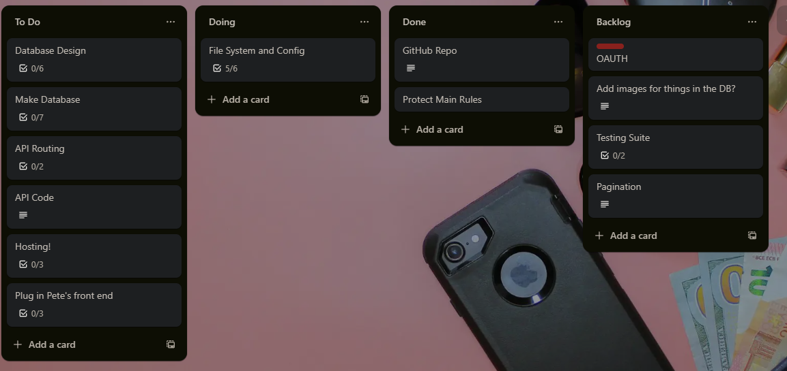
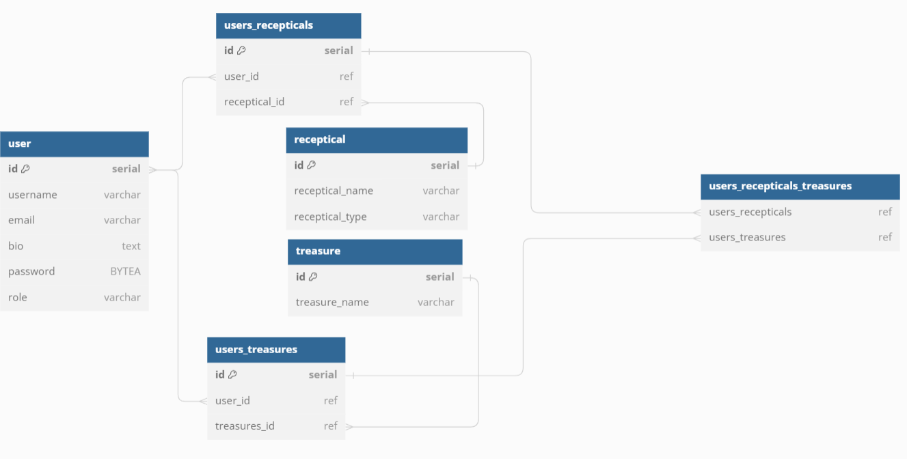
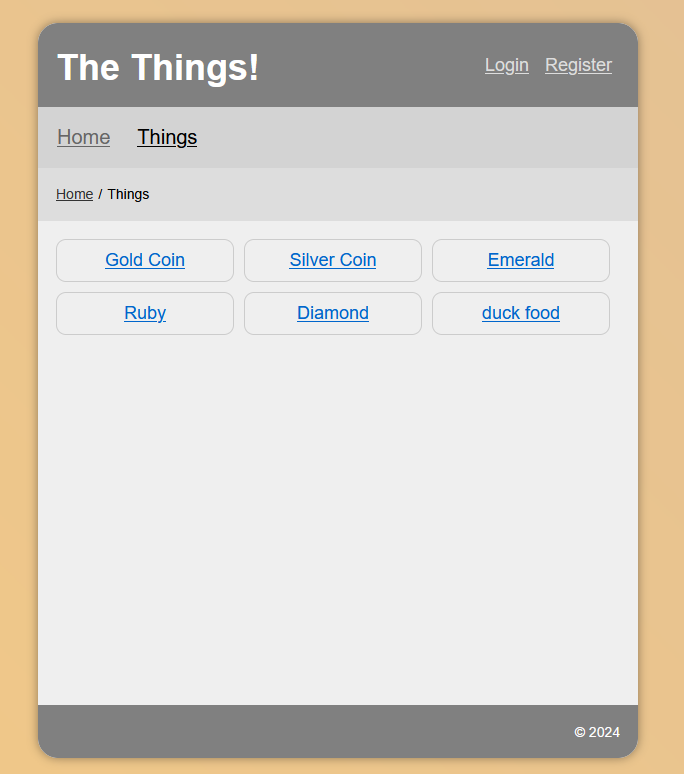

# Show Us Your Contents

The final group project for TechNative Academy. This app is the backend and consists of an API and database. The theme is whatever is in your bag, pockets, drawers, etc.

## Meet the Team

- [Jo](https://github.com/Jo-Pickering)
- [Conrad](https://github.com/cnrdgrgry)
- [Susannah](https://github.com/sfbennett)
- [Chloe](https://github.com/ChloeSAPage)

# Tech stack:

- Express
- Posgresql
- React
- Javascript
- CSS

## View Project

[View project here](https://showusyourcontents.netlify.app/) <br>
Due to the API being hosted on render it may take up to 50 seconds for content to load. Please be patient.

Alternatively clone this repo and host locally. [Instructions here](#local-installation-guide)

# Our Process

<details>
<summary> Day 1</summary>

For day one we did quad programming and accomplished the following:

- decided on our theme
- created a trello board
- created our repo
- talked about our MVP
- created a schema for our db
- created the db
- inserted dummy data into the db
- hosted the db on Supabase
- created the API with 1 endpoint to get all users in the db




</details>

<details>
<summary> Day 2</summary>

For day two we did quad programming and accomplished the following:

- added endpoints that GET, POST, PUT, DELETE for users, treasures and bags
- hosted the API on render
- connected the backend to Pete's provided frontend
- hosted the frontend on netlify
- added the ability to register and login using authentication (using Pete's example backend as a template)



</details>

<details>
<summary> Day 3</summary>

</details>

<details>
<summary> Day 4</summary>

</details>

<details>
<summary> Day 5</summary>

</details>

# Technical Information

## Database

## Using the API

### Endpoints

## Local Installation Guide

> [!IMPORTANT]
> You will need:
>
> -   [ ] Postgresql credentials


### Installing

#### 1. Clone the Repository

Using Git, copy these files into a folder.
Use this command:

```
git clone https://github.com/technative-academy/ShowUsYourContents.git
```
as well as the frontend

```
git clone https://github.com/technative-academy/show-us-your-contents-frontend.git
```

#### 2. Install the requirements for frontend and backend

```
npm install
```

#### 3. Edit the .env file in the root directory and add your SQL details.

Refer to the `.env.example` files, copy them exactly into a new file called `.env`.

> [!IMPORTANT]
> JWT Secrets can be a random string of letters and integers
> If you change the ports the apps are running on please update them in the .env accordingly

#### 4. Manually create a DB

> [!WARNING]
> Make a Postgres database
> Use the supplied code in the `/db` directory to create and populate tables. **A DB will _not_ be automatically created**

#### 5. Run

1. Run the backend `ShowUsYourContents` using `npm run start`
2. Run the frontend `show-us-your-contents-frontend` using `npm run dev`
3. Open the front end in your browser at this URL: `http://localhost:5173/`
