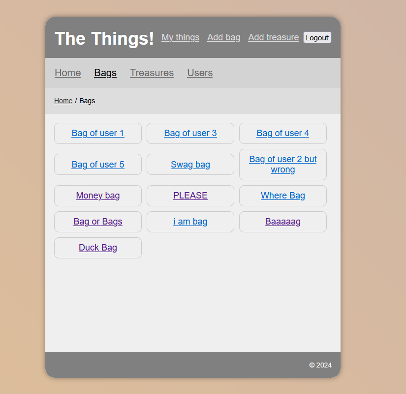
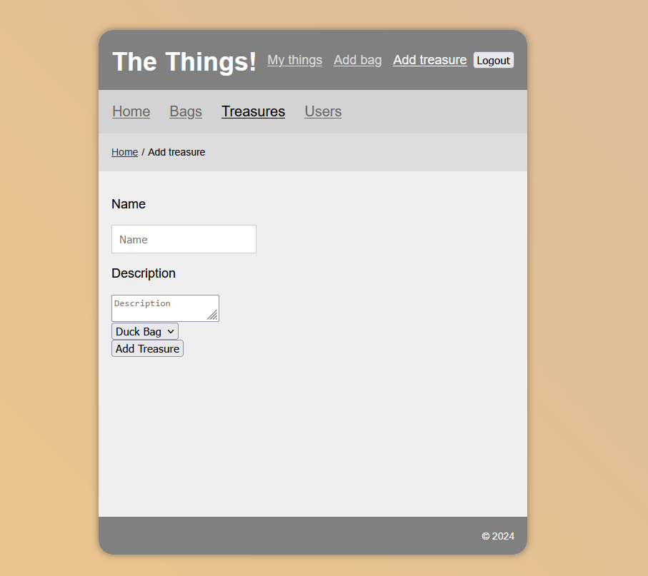

# Show Us Your Contents

The final group project for TechNative Academy. This app is the backend and consists of an API and database. The theme is whatever is in your bag, pockets, drawers, etc.

## Meet the Team

- [Jo](https://github.com/Jo-Pickering)
- [Conrad](https://github.com/cnrdgrgry)
- [Susannah](https://github.com/sfbennett)
- [Chloe](https://github.com/ChloeSAPage)

# Tech stack:

- Express
- Posgresql
- React
- Javascript
- CSS

## View Project

[View project here](https://showusyourcontents.netlify.app/) <br>

> [!NOTE]
> Due to the API being hosted on render it may take up to 50 seconds for content to load. Please be patient.

Alternatively clone this repo and host locally. [Instructions here](#local-installation-guide)

# Our Process

<details>
<summary> Day 1</summary>

For day one we did quad programming and accomplished the following:

- Decided on our theme
- Created a trello board
- Created our repo with protect main rule
- Talked about our MVP
- Created a schema for our db
- Created the db
- Inserted dummy data into the db
- Hosted the db on Supabase
- Created the API with 1 endpoint to get all users in the db


</details>

<details>
<summary> Day 2</summary>

For day two we did quad programming and accomplished the following:

- Added endpoints that GET, POST, PUT, DELETE for users, treasures and bags
- Hosted the API on render
- Connected the backend to Pete's provided frontend that renders treasures
- Hosted the frontend on netlify
- Added the ability to register and login using authentication (using Pete's example backend as a template)


</details>

<details>
<summary> Day 3</summary>

For day three we did quad programming and accomplished the following:

- Added ability to add new bag through the frontend
- Rendered all bags in the db
- Update the API bag endpoint
- Reorder the nav bar
- Started on implementing the add treasure view - we added a drop down menu that includes all the bags of the current user






</details>

<details>
<summary> Day 4</summary>

For day four we did quad programming and accomplished the following:

- Implemented full functionality of add treasure view
- Add full functionality of the my things view, which shows all treasures and what bags they are in
- Allow users to edit and delete treasures
- Allow users to delete bags
- Added styling and a logo
- Update the breadcrumb for 'Things' to 'Treasures'
- Write a blurb for the home page
- Add placeholder text for the dropdown menu

</details>

<details>
<summary> Day 5</summary>

For day five we did quad programming and accomplished the following:
- Rendered a users list of things on the users view
- Worked on presentation


</details>

# Technical Information

## Database

To set up this project locally, you'll need to run the SQL included in the `db`` folder.

## Endpoints

### Endpoints - Auth
Register a new user
Method: POST
URL: /register

Login a user
Method: POST
URL: /login

Logout a user
Method: POST
URL: /logout

### Endpoints - Users
Get all users <br>
Method: GET  <br>
URL: /users <br>

Get user by ID <br>
Method: GET <br>
URL: /users/:id <br>

Add a new user
Method: POST
URL: /users
Update/replace a user

Method: PUT
URL: /users/:id
Delete a user

Method: DELETE
URL: /users/:id
Endpoints - Bags
Get all bags

Method: GET
URL: /bags
Get bag by user ID

Method: GET
URL: /fetchByUser
Get bag by ID

Method: GET
URL: /bags/:id
Add a new bag

Method: POST
URL: /bags
Update/replace a bag

Method: PUT
URL: /bags/:id
Delete a bag

Method: DELETE
URL: /bags/:id
Endpoints - Treasures
Get all treasures

Method: GET
URL: /treasures
Get treasures by ID

Method: GET
URL: /treasures/:id
Add a new treasure

Method: POST
URL: /treasures
Update/replace a treasure

Method: PUT
URL: /treasures/:id
Delete a treasure

Method: DELETE
URL: TBC

## Local Installation Guide

> [!IMPORTANT]
> You will need:
>
> -   [ ] Postgresql credentials


### Installing

#### 1. Clone the Repository

Using Git, copy these files into a folder.
Use this command:

```
git clone https://github.com/technative-academy/ShowUsYourContents.git
```
as well as the frontend

```
git clone https://github.com/technative-academy/show-us-your-contents-frontend.git
```

#### 2. Install the requirements for frontend and backend

```
npm install
```

#### 3. Edit the .env file in the root directory and add your SQL details.

Refer to the `.env.example` files, copy them exactly into a new file called `.env`.

> [!IMPORTANT]
> JWT Secrets can be a random string of letters and integers
> If you change the ports the apps are running on please update them in the .env accordingly

#### 4. Manually create a DB

> [!WARNING]
> Make a Postgres database
> Use the supplied code in the `/db` directory to create and populate tables. **A DB will _not_ be automatically created**

#### 5. Run

1. Run the backend `ShowUsYourContents` using `npm run start`
2. Run the frontend `show-us-your-contents-frontend` using `npm run dev`
3. Open the front end in your browser at this URL: `http://localhost:5173/`
